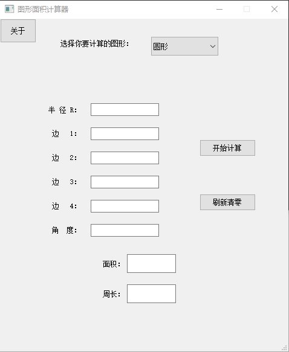
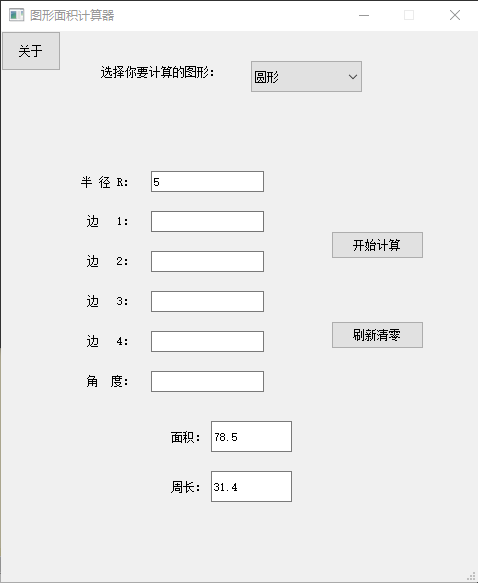
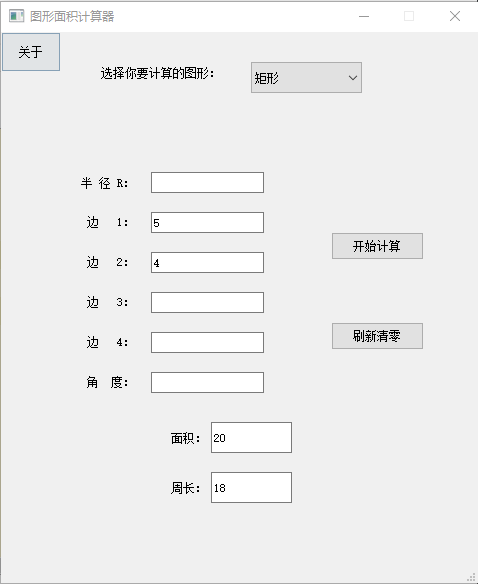
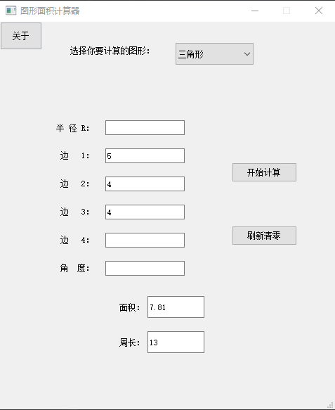

# 通用面积计算器

## 1. 团队分工

+ Ui设计与逻辑分配--刘博原
+ 逻辑设计与编写--王志强、甘海龙
+ 代码审查与调试--龚利天
+ 冯树垚同学态度消极，未参与开发

## 2. GitHub仓库

+ 由于项目过小，我们未使用Git进行版本控制
+ 项目完成后，我们才将源码进行上传
+ [项目地址]([Gonglitian/Code-Force (github.com)](https://github.com/Gonglitian/Code-Force))

# 3. 使用方法
## 1.环境配置
+ python版本： 3.8.6
+ 外部依赖库：
    + PyQt5 5.15.7
## 2.外部依赖库的安装
+ 在终端输入

  ```python
  pip install PyQt5
  ```

## 3. 程序运行

+ 安装完python和PyQt后，用python解释器运行area.py文件
## 4. 运行效果








